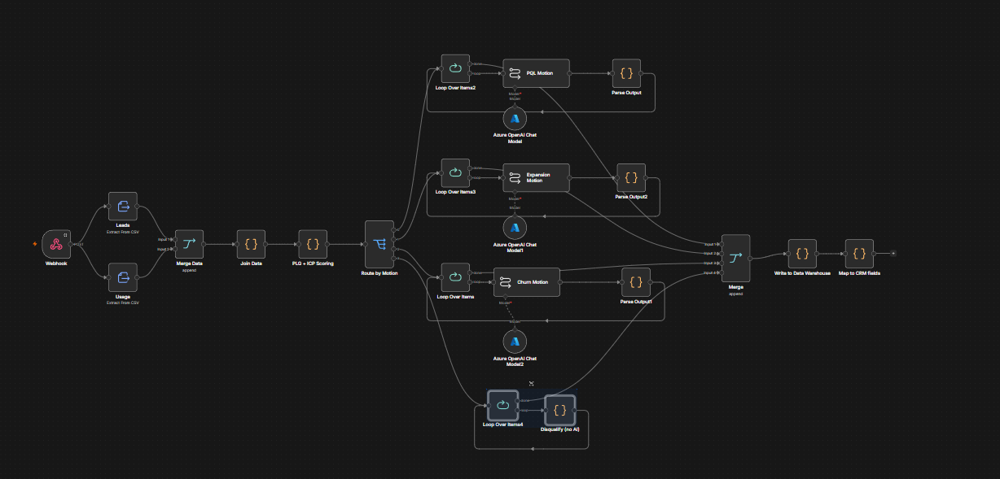

# PLG GTM Workflow

An n8n workflow that scores leads on ICP fit and product usage, routes each one to the right sales motion, and drafts hyperpersonalized outreach context for the rep, all triggered automatically from incoming lead and usage data.

📹 [Full video walkthrough](https://drive.google.com/file/d/1flAnsCRhlrGUrxmgMVUbhgaoRUfLEE5b/view?usp=sharing)

## Problem

One of the biggest hurdles in a PLG motion is knowing which customers to reach out to, when to reach out to them, and how to make that outreach relevant instead of generic. Reps often either reach out too early, too late, or with messaging that has nothing to do with what the account is actually doing in the product. Getting both the timing and the personalization right, at scale, is hard to do manually.

## Solution

The workflow is built around a demo company in the creative software space (an Adobe-style asset management tool), and runs end to end from raw data to rep-ready context:

1. **Ingest:** A webhook receives two CSV files: a leads file with firmographic details (company name, contact title, location, industry tags, etc.) and a usage file with product data (plan tier, usage metrics, feature adoption). The two datasets are joined on account ID.
2. **Score:** Each account gets two scores. A firmographic score measures ICP fit based on signals like industry tag, company size, and location. A usage score measures product engagement, essentially a PLG signal for how actively and how well an account is using the product. These are combined into a single composite score representing overall fit and readiness to be actioned.
3. **Route:** Based on the composite score and underlying signals, each lead is classified into one of four motions:
   - **PQL:** Free-tier users with high usage, good candidates for an upgrade conversation.
   - **Expansion:** Paying customers with high usage, good candidates for more credits or a higher-tier plan.
   - **Churn:** Paying customers with declining or low usage, flagged for a renewal conversation before it becomes a churn risk.
   - **No action:** Leads that don't clearly fit any of the above are left alone for now and revisited later.
4. **Generate context:** Each of the three actionable motions (PQL, expansion, churn) has its own AI agent chain that takes the account's data and drafts a structured, contextual brief for the sales rep, including the ICP score reasoning, the PLG/usage score reasoning, why now is the right time to reach out, a pain hypothesis for the account, and a tailored outreach message the rep can use as a starting point.
5. **Output:** The three motion branches are merged back together. In this demo the output stops here, but it's designed to be written to a data warehouse and/or synced back into a CRM depending on the company's stack.

## Expected Outcome

- Reduced manual effort identifying which leads or accounts to prioritize, and across which motion
- Reps get ready-made, hyperpersonalized context instead of starting outreach cold
- Outreach timing is tied to actual usage signals rather than a fixed cadence, so reps reach out closer to the moment an account is actually ready
- A structured, repeatable framework for turning raw usage and firmographic data into action, rather than relying on reps to notice patterns manually

## Stack

n8n · Claude (Anthropic) · Webhook ingestion (CSV) · Data warehouse / CRM (configurable output)

## Setup Notes

- Expects two CSV files delivered via webhook: a leads file and a usage file, joined on a shared account ID field
- ICP scoring criteria (industry tags, size, location, etc.) should be adjusted to match your own target market
- Motion thresholds (what counts as "high usage," what plan tiers count as PQL vs. expansion candidates) are configurable and were tuned for the demo dataset
- Requires an Anthropic API key for the per-motion context generation agents
- Final output currently ends at the merge step; connect a data warehouse or CRM write-back node depending on your stack
